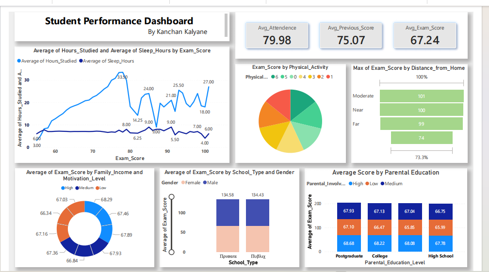

# 📊 Student Performance Dashboard (Power BI Project)

## 📌 Overview
Analyzed student performance using Power BI.
Built interactive dashboards to identify patterns in study habits, sleep, and academic scores.
## 🛠️ Tools Used
- Power BI
- Excel

## 📈 Key Insights
- Students who study more score higher
- Sleep has moderate impact
- Family background affects performance

## 🚀 Features
- Interactive dashboard
- Data visualization using Power BI
- Insights on student behavior

## 📸 Dashboard Preview

